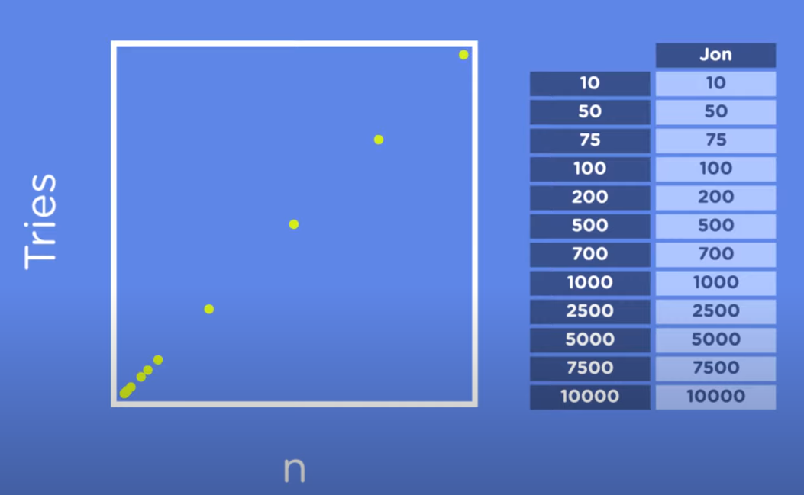
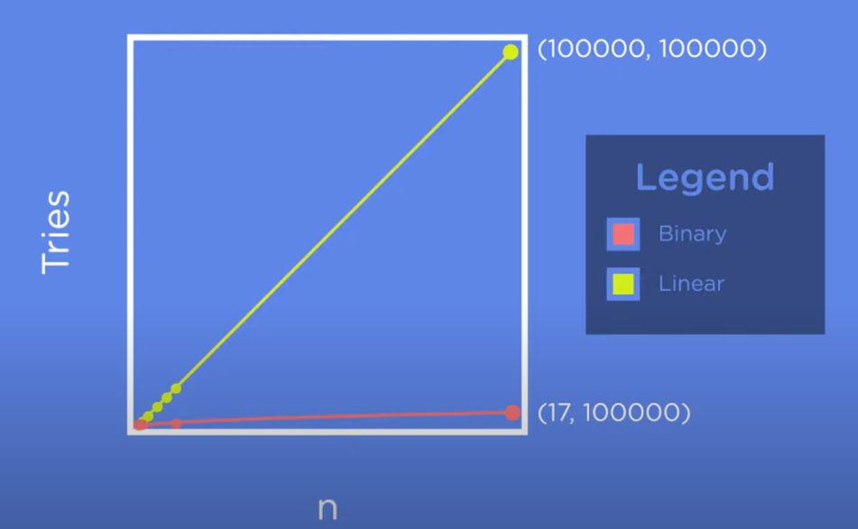

## Algorithms

### Definition

A set of steps or instructions (a program takes) for completing a task.

### Algorithm Thinking

When we look at a problem, we should be able to break it down into distinct steps. Then, we should identify which algorithm or data structure is best. This concept is called **Algorithm Thinking**.

An important step is to cleary define what the problem set is and clarify what values count as inputs.

<ins>Linear Search</ins>:
  1. Start at beginning;
  2. Compare current value to target;
  3. Move sequentially;
  4. Reach end of list.

#### Rules

- Cleary define problem statement, input and output.
- The steps in the algorithm need to be in a very specific order.
- The steps also need to be distinct (no subtasks).
- The algorithm should produce a result (same always).
- The algotithm should complete in a finite amout of time.

#### Correctness / Efficiency

Before we test the efficiency of our algorithms, we must certify that the algorithm produces the correct output giving a input. This is call *correctness* 

**Time complexity** is a measure of how long it takes the algorithm to run.

**Space complexity** is the amout of memory taken on the computer.

---

We can use the worst case scenarium for a algorithm in order to se the worst possiblem result. This way, we will not have any surprises. In linear search, we have this graphic:

Where *n* is maximun number of values in a series, representing the worst case scenarium.

In the binary search, we have:

This is the *Growth Rate* also know as *Order of Growth*.

### Big O

Theoritical definition of the complexity of an algorithm as a function of the size. It is used to describe complexity.

**O comes from the Order of magnitude of complexity*

- For linear search we say the complexity is: O(n)
- For binary search we say the complexity is: O(log n)
- Checking the equality of a giving value takes the same time every time, which is representated by: O(1)   (**Reads constant time*)

**log is the oposite of exponential. E.g.: 2³ = 8 | log2 8 = 3*

